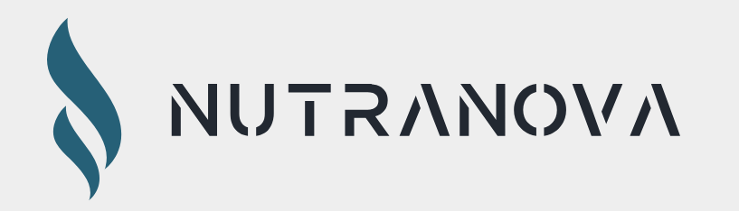

# NUTRANOVA



NutraNova (a recipe sharing platform) is an online community designed to empower users to discover, share, and explore a wide range of healthy and nutritious recipes. The platform aims to foster a sense of community, encouraging users to embrace wellness through the joy of cooking and healthy eating. Built using microservice architecture. This project is composed of multiple independently deployable services that work together to deliver a cohesive backend system.


## Features

- User Profiles: Users can create personalized profiles with dietary preferences, health goals, and allergen information. 
- Recipe Upload: Users can upload their own wellness recipes, complete with ingredients, cooking instructions, and nutritional information. 
- Recipe Search and Discovery: Implemented with a search functionality and a recommendation engine that allows users to find recipes based on keywords, ingredients, dietary restrictions, or specific health benefits. 
- Rating and Reviews: Enable users to rate and review recipes they have tried, sharing their experiences and recommendations.
- Nutritional Information: Integrate a nutritional analysis API to provide users with detailed information about the nutritional content of each recipe.


## 🧱 Architecture Overview

Diagram Here - [link](https://drive.google.com/file/d/1XX-ZNp_Tdu5SvoqzGbNKXBy-TT8YIJxk/view?usp=sharing)


Brief explanation of the architecture:
- **Users Service** – This [service](https://nutranova-user.onrender.com/graphql/) handles user authentication, storage of user data, and profile management.
- **Recipes Service** –  This [service](https://nutranova-recipe.onrender.com/graphql/) is responsible storing and managing recipe data, including categories and tags, support efficient querying and filtering of recipe data
- **Recommendations Service** – This service handles the creation of vector embeddings to fetch recommended recipes with cosine similarity algorithm, on data gotten from Neo4j graph database.
- **RabbitMQ** – Used for async communication between services
- **Apollo Federation** – [Supergraph](https://prod--nutranova.apollographos.net/graphql) acting as an API gateway routes requests to appropriate GraphQL microservices
- **Database/Caching** – Each service uses its own DB (PostgreSQL, MongoDB, Neo4j, Redis)

## 🧠 Key Concepts

- **Microservices**
- **Asynchronous Event-Driven Communication**
- **Database per Service Pattern**
- **Dockerized Development**


## 🧪 Tech Stack

- **Language**: Python
- **Frameworks**: Django
- **Authentication**: Auth0
- **Databases**: PostgreSQL, MongoDB, Neo4j & Redis
- **Messaging**: RabbitMQ
- **DevOps**: Docker & CircleCI
- **API Communication Architecture**: GraphQL & REST


## ⚙️ Getting Started

### 1. Clone this repo
```bash
git clone https://github.com/Princeigwe/NutraNova.git
cd NutraNova
```


### 2. Clone each service repo into the directory

```bash
git clone https://github.com/Princeigwe/NutraNova_Auth_User_Service.git
git clone https://github.com/Princeigwe/NutraNova-Recipe-Feed-Service.git
git clone https://github.com/Princeigwe/NutraNova-Recommendations-Service.git 
```

### 3. Build and run docker compose
```bash
docker compose up --build
```

## 🔑 Environment Variables

To run this project, you will need to add the following environment variables to your `.env` files for each service:


### Users Service
- `AUTH0_DOMAIN`: Your Auth0 domain.
- `AUTH0_CLIENT_ID`: Your Auth0 client ID.
- `AUTH0_CLIENT_SECRET`: Your Auth0 client secret.
- `AUTH0_DOMAIN`: Your Auth0 domain for your application.
- `CLIENT_APPLICATION_DOMAIN`: Auth0 client domain for callback
- `DATABASE_URL`: Connection string for the PostgreSQL database.
- `SECRET_KEY`: Django Secret Key
- `AIVEN_DATABASE_URI`: Aiven database URI
- `AIVEN_DATABASE_NAME`
- `AIVEN_HOST`
- `AIVEN_PORT`
- `AIVEN_USER`
- `AIVEN_PASSWORD`
- `JWT_SECRET_KEY`
- `CLOUDINARY_CLOUD_NAME`: Cloudinary cloud application name for the project
- `CLOUDINARY_API_KEY`
- `CLOUDINARY_API_SECRET`
- `REDIS_URL`
- `RABBITMQ_STREAM`: Name of RabbitMQ stream
- `CLOUDAMQP_HOST`
- `CLOUDAMQP_USER`
- `CLOUDAMQP_PORT`
- `CLOUDAMQP_URL`
- `CHEF_DATA_UPDATE_MESSAGE_TYPE`: Custom filter used to regulate consumer action when user data is received
  #### local Docker database variables for users service
- `DEV_USERS_DB_USERNAME`
- `DEV_USERS_DB_PASSWORD`
- `DEV_USERS_DB_NAME`
- `DEV_USERS_DB_HOST`
- `DEV_USERS_DB_PORT`


### Recipes Service
- `AIVEN_DATABASE_URI`
- `AIVEN_DATABASE_NAME`
- `AIVEN_HOST`
- `AIVEN_PORT`
- `AIVEN_USER`
- `AIVEN_PASSWORD`
- `JWT_SECRET_KEY`
- `CALORIES_NINJA_API_KEY`: The API key for the service:(https://calorieninjas.com/) that calculates food nutritional values.- `CLOUDINARY_CLOUD_NAME`
- `CLOUDINARY_API_KEY`
- `CLOUDINARY_API_SECRET`
- `REDIS_URL`
- `REDIS_SERVER_NAME`
- `RABBITMQ_STREAM`
- `CLOUDAMQP_HOST`
- `CLOUDAMQP_USER`
- `CLOUDAMQP_PORT`
- `CLOUDAMQP_URL`
- `CHEF_DATA_UPDATE_MESSAGE_TYPE`
- `RECIPE_PUBLISHED_MESSAGE_TYPE`
- `REQUEST_RECOMMENDED_FEED_MESSAGE_TYPE`
- `RECOMMENDED_FEED_MESSAGE_TYPE`
- `VOTE_RECIPE_MESSAGE_TYPE`
- `MONGODB_NUTRANOVA_CLUSTER_USERNAME`
- `MONGODB_NUTRANOVA_CLUSTER_PASSWORD`
- `MONGODB_NUTRANOVA_CLUSTER_CONNECTION_STRING`
- `MONGODB_NUTRANOVA_CLUSTER_DATABASE_NAME`
- `MONGODB_NUTRANOVA_CLUSTER_RECIPE_STORIES_COLLECTION`
- `USER_SERVICE_API_ENDPOINT`: User service GraphQL endpoint
- `RECOMMENDATION_SERVICE_API_ENDPOINT`: Recommendation service GraphQL endpoint
  #### local Docker database variables for recipes service
- `DEV_RECIPES_DB_USERNAME`
- `DEV_RECIPES_DB_PASSWORD`
- `DEV_RECIPES_DB_NAME`
- `DEV_RECIPES_DB_HOST`
- `DEV_RECIPES_DB_PORT`


### Recommendations Service
- `DATABASE_URL`: Connection string for the Neo4j database.
- `RABBITMQ_URL`: URL for RabbitMQ messaging.
- `NEO_4J_AURA_DB_USERNAME`
- `NEO_4J_AURA_DB_PASSWORD`
- `NEO_4J_AURA_DB_HOST`
- `NEO_4J_AURA_DB_CONNECTION_URI`
- `RABBITMQ_STREAM`
- `CLOUDAMQP_HOST`
- `CLOUDAMQP_USER`
- `CLOUDAMQP_PORT`
- `CLOUDAMQP_URL`
- `CHEF_DATA_UPDATE_MESSAGE_TYPE`
- `RECIPE_PUBLISHED_MESSAGE_TYPE`
- `REQUEST_RECOMMENDED_FEED_MESSAGE_TYPE`
- `RECOMMENDED_FEED_MESSAGE_TYPE`
- `VOTE_RECIPE_MESSAGE_TYPE`
  #### local Docker database variables for recommendations service
- `DEV_NEO_4J_AURA_DB_PASSWORD`
- `DEV_NEO_4J_AURA_DB_USERNAME`
- `DEV_NEO_4J_AURA_DB_HOST`


## Recipe Tags
#### Weight Loss
#### Desserts
#### Dairy-Free
#### Dinner
#### Vegan
#### Heart-Healthy
#### Salad
#### Snack
#### Spicy
#### Better-Sleep
#### Low-Cholesterol
#### Lunch
#### Breakfast
#### Gluten-Free
#### Kidney-Friendly
#### Savoury
#### Diabetic-Friendly
#### Italian
#### Low-Calorie
#### High-Protein
#### Low-Carb
#### Vegetarian
#### Paleo
#### Sugar-Free
#### Heart-Healthy
#### High-Fiber
#### Nut-Free
#### Clean-Eating
#### Mediterranean
#### Asian
#### Mexican
#### Middle Eastern
#### American
#### French
#### Indian
#### African
#### Low-Fat
#### Anti-Inflammatory
#### Balanced
#### High-Fiber
#### Vitamin-Rich
#### Post-Workout
#### Prebiotic
#### Probiotic
#### Low-Glycemic
#### Satiating
#### Hydrating
#### Metabolism-Boosting
#### Bone Health
#### Anti-Cancer
#### Weight management
#### Energy-Boosting
#### Omega-3 Rich
#### Iron-Rich
#### Mind-Boosing
#### Gut-Healing
#### Sweet
#### Savoury
#### Spicy
#### Bitter
#### Sour
#### Creamy
#### Herbaceous
#### Garlicky
#### Umami
#### Citrusy
#### Mild
#### Aromatic
#### Pescatarian
#### Digestive
#### Immunity
#### Mobility
#### Weight Management
#### milk-free
#### egg-free
#### peanut-free
#### soy-free
#### wheat-free
#### tree nuts-free
#### shellfish-free
#### sesame-free
#### garlic-free
#### Hypertension
#### Lactose Intolerance
#### Fructose Intolerance
#### Pregnancy